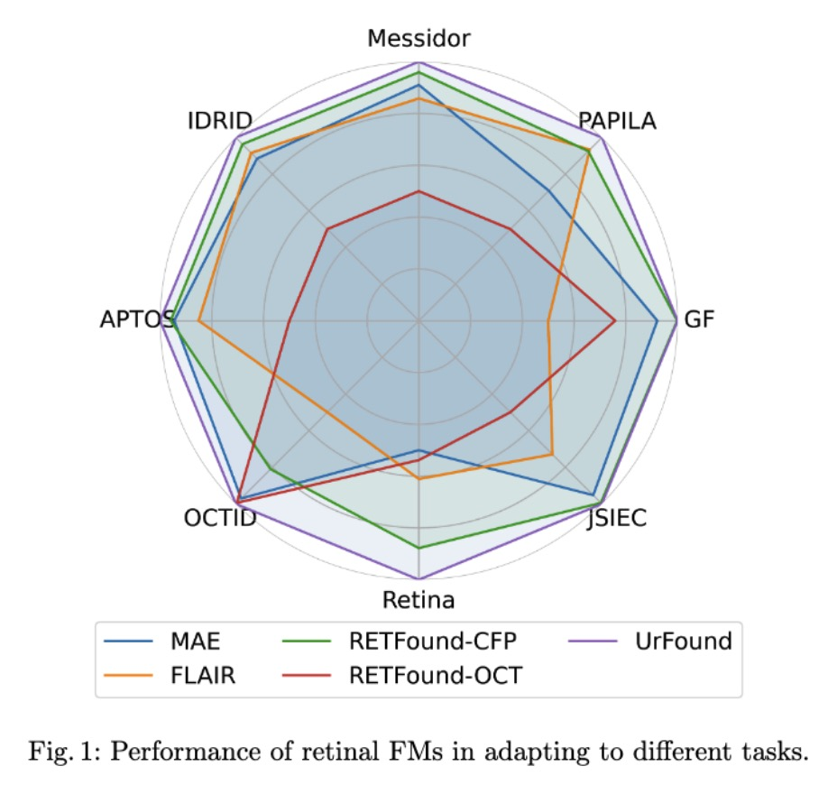
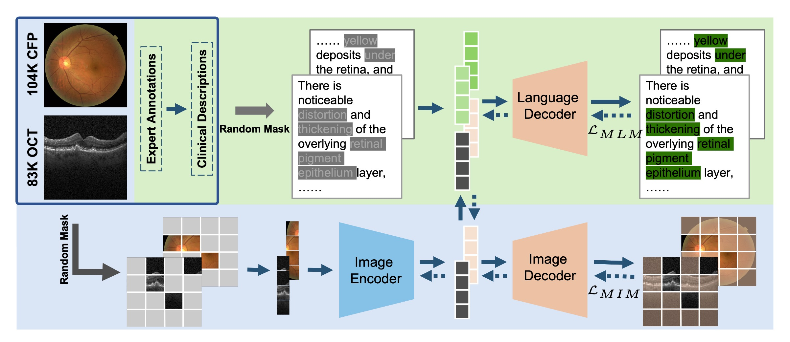
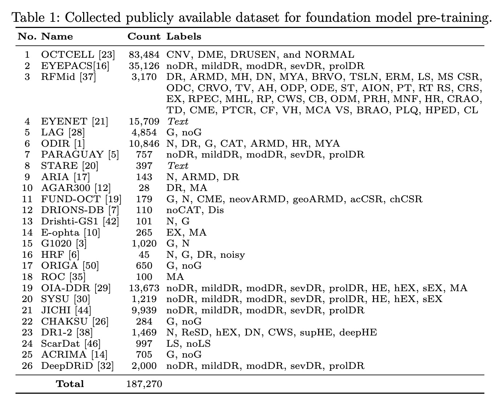
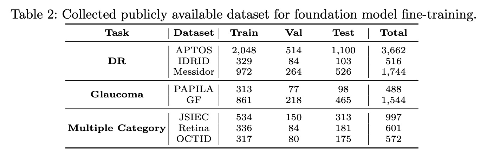

# 【MICCAI 2024】 UrFound: Towards Universal Retinal Foundation Models via Knowledge-Guided Masked Modeling

This repo is the official implementation of [UrFound](https://arxiv.org/pdf/2408.05618).

<div align="center">
    
</div>

## Abstract

Retinal foundation models aim to learn generalizable representations from diverse retinal images, facilitating label-efficient model adaptation across various ophthalmic tasks. Despite their success, current retinal foundation models are generally restricted to a single imaging modality, such as Color Fundus Photography (CFP) or Optical Coherence Tomography (OCT), limiting their versatility. Moreover, these models may struggle to fully leverage expert annotations and overlook the valuable domain knowledge essential for domain-specific representation learning. To overcome these limitations, we introduce UrFound, a retinal foundation model designed to learn universal representations from both multimodal retinal images and domain knowledge. UrFound is equipped with a modality-agnostic image encoder and accepts either CFP or OCT images as inputs. To integrate domain knowledge into representation learning, we encode expert annotation in text supervision and propose a knowledge-guided masked modeling strategy for model pre-training. It involves reconstructing randomly masked patches of retinal images while predicting masked text tokens conditioned on the corresponding retinal image. This approach aligns multimodal images and textual expert annotations within a unified latent space, facilitating generalizable and domain-specific representation learning. Experimental results demonstrate that UrFound exhibits strong generalization ability and data efficiency when adapting to various tasks in retinal image analysis. By training on ~180k retinal images, UrFound significantly outperforms the state-of-the-art retinal foundation model trained on up to 1.6 million unlabelled images across 8 public retinal datasets.

## Framework

<div align="center">
    
</div>

## Get started

### Installation

```bash
# Clone this repo
git clone https://github.com/yukkai/UrFound.git
cd UrFound

# Create a conda enviroment
conda create -n urfound python=3.7.5

# Activate the environment
conda activate urfound

# Install dependencies
pip install torch==1.8.1+cu111 torchvision==0.9.1+cu111 torchaudio==0.8.1 -f https://download.pytorch.org/whl/torch_stable.html
pip install -r requirements.txt
```

### Datasets

* Pretrain dataset ([FLAIR](https://github.com/jusiro/FLAIR) for more details)

<div align="center">
    
</div>

* Finetune dataset ([RETFound](https://github.com/rmaphoh/RETFound_MAE) for more details)

<div align="center">
    
</div>

### How to Run

* Pretrain
```bash
pretrained_model='model pre-trained on ImageNet'
pretrain_data='downloaded pretrain dataset'
output_path='output path'

CUDA_VISIBLE_DEVICES=0 ./main_pretrain_urfound.py \
            --num_workers 32 \
            --accum_iter 2 \
            --batch_size 128 \
            --model urmodel \
            --norm_pix_loss \
            --mask_ratio 0.75 \
            --epochs 200 \
            --warmup_epochs 40 \
            --blr 1.5e-4 --weight_decay 0.05 \
            --resume ${pretrained_model} \
            --data_path ${pretrain_data} \
            --output_dir ${output_path} \
            --data_mode fundus_oct \
```

* Finetune
```bash
data_i='downstream task dataset'
nb_classes='class num'
Pretraining_model='pretrained model'
Out_folder='output path'

CUDA_VISIBLE_DEVICES=0 python ./main_finetune.py \
            --batch_size 16 \
            --world_size 1 \
            --model vit_base_patch16 \
            --epochs 50 \
            --blr 5e-3 --layer_decay 0.65 \
            --weight_decay 0.05 --drop_path 0.2 \
            --nb_classes ${nb_classes} \
            --data_path ./${data_i}/ \
            --task ${data_i}/ \
            --finetune ${Pretraining_model} \
            --input_size 224 \
            --log_dir ${Out_folder}/ \
            --output_dir ${Out_folder}/
```

## Citation

```  
  @article{yu2024urfound,
  title={UrFound: Towards Universal Retinal Foundation Models via Knowledge-Guided Masked Modeling},
  author={Yu, Kai and Zhou, Yang and Bai, Yang and Da Soh, Zhi and Xu, Xinxing and Goh, Rick Siow Mong and Cheng, Ching-Yu and Liu, Yong},
  journal={arXiv preprint arXiv:2408.05618},
  year={2024}
}
```

## Acknowledgements

We extend our appreciation to the developers of the [RETFound](https://github.com/rmaphoh/RETFound_MAE), [FLAIR](https://github.com/jusiro/FLAIR) and [MRM](https://github.com/RL4M/MRM-pytorch) project for sharing their open-source implementation and providing guidance on preparing the data.